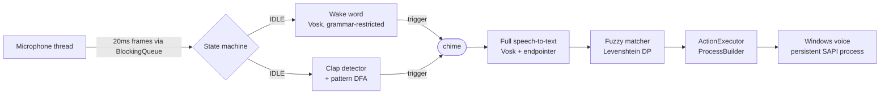

# Jarvis — offline voice assistant for Windows

A desktop assistant written in Java. Say **"Jarvis"** (or clap a custom
rhythm), hear a chime, then speak a command like *"open Steam"*.
Everything runs **offline** — no cloud APIs, no network latency, nothing
leaves your machine.

## How it works



- **Audio pipeline** — a producer thread reads the mic and pushes frames
  onto a `BlockingQueue`; the orchestrator consumes them (classic
  producer–consumer concurrency).
- **Wake word** — Vosk running with a grammar restricted to just
  `jarvis` + unknown, which is cheap and rarely false-triggers.
- **Clap activation** — an energy-spike detector (adaptive statistical
  threshold over a rolling noise floor) feeds a **DFA over timed gaps**:
  `"short,short"` means three quick claps. Edit the pattern in
  `config/settings.json`.
- **Command matching** — Levenshtein edit distance (dynamic programming)
  so "opens team" still launches Steam.
- **Actions** — `config/commands.json` maps phrases to actions. No code
  changes needed to add a command.

## Module map (MH602)

| Component | Module |
|---|---|
| Producer–consumer audio pipeline, threads | CS240 Operating Systems & Concurrency |
| Clap pattern as a DFA over timed events | CS290 Theory of Computation |
| Levenshtein DP fuzzy matching | CS210/CS211 Algorithms & Data Structures |
| Adaptive noise-floor threshold (EMA) | ST221 Statistics |
| JUnit suites for FSM/matcher/distance | CS265 Software Testing |
| Instant chime feedback, forgiving matching | CS242 User-Centred Software Engineering |

## Setup (one time)

Requirements: JDK 21+, Maven, a microphone.

```powershell
./setup.ps1        # downloads the ~40 MB offline speech model
mvn package        # builds target/jarvis-1.0.0.jar (runs the tests too)
```

## Run

```powershell
./run.ps1                # or: java -jar target/jarvis-1.0.0.jar
./run.ps1 --check        # environment sanity check (no mic capture)
```

Then: say **"Jarvis"** → wait for the chime → say **"open steam"**.

## Customising

### Add a command
Edit `config/commands.json`:

```json
{
  "name": "open-discord",
  "phrases": ["open discord", "launch discord"],
  "action": { "type": "launch", "target": "C:\\Users\\you\\AppData\\Local\\Discord\\Update.exe --processStart Discord.exe" },
  "reply": "Opening Discord"
}
```

Action types: `launch` (app/URI via Windows shell), `url`, `shell`
(PowerShell one-liner), `time`, `exit`.

### Change the clap pattern
In `config/settings.json`, `clapPattern` is the sequence of **gaps**
between claps: `"short,short"` = 3 quick claps,
`"short,long,short"` = clap-clap … clap-clap. `clapSensitivity` is how
many times louder than background noise a clap must be (raise it if it
false-triggers, lower it if claps are missed).

## Roadmap
- One-breath commands ("Jarvis open Steam" with no pause)
- Porcupine wake-word engine (lower CPU when idle; needs a free Picovoice key)
- Usage history in SQLite to rank ambiguous matches (CS285)
