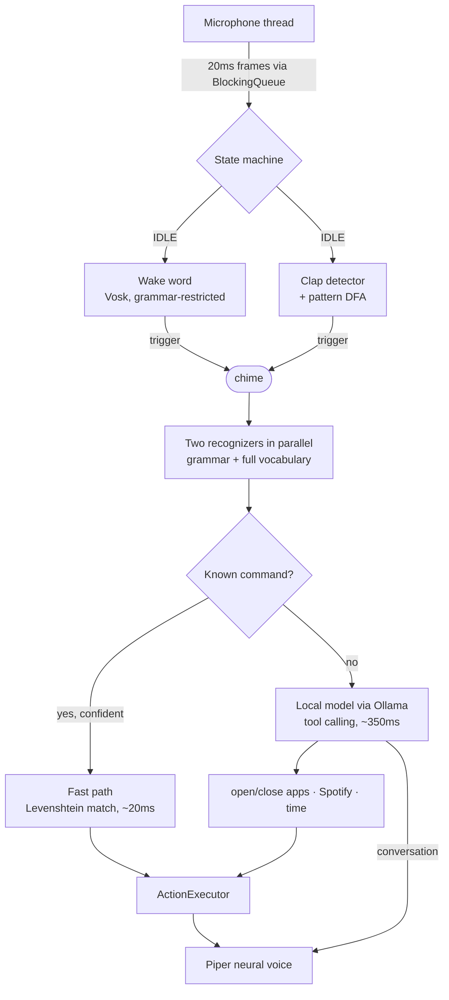

# Jarvis — offline AI voice assistant for Windows

A desktop assistant written in Java. Say **"Jarvis"** (or clap a custom
rhythm), hear a chime, then either fire a command — *"open Steam"* — or
just talk to it. Everything runs **offline on your own machine**: the
speech recognition, the language model, and the voice. Nothing you say
leaves the PC.

## How it works



**Two-tier routing** is what keeps it fast. Anything in `commands.json`
executes immediately without touching the AI. Everything else — questions,
chat, music requests, phrasings nobody anticipated — goes to the brain,
which can call the same actions as tools.

**Two brains, pick per settings** (`brainProvider`): Google's **Gemini**
(online, free tier, markedly better judgement and knowledge) or the local
**Qwen via Ollama** (fully offline). `auto` uses Gemini when a key is
configured and falls back to local otherwise.

## Dashboard

A local control panel at **http://127.0.0.1:7580** (say *"open the
dashboard"*): toggle whether Jarvis is listening, switch his voice and
hear it immediately, edit his personality live, and watch a feed of what
he heard versus what he did.

## Security

- **Local by design** — wake word, speech recognition, and the voice run
  on this machine. With the local brain, nothing leaves the PC; with the
  Gemini brain, conversation text goes to Google and nothing else.
- **The dashboard binds to 127.0.0.1 only** — nothing on the network can
  see or control the assistant.
- **Sensitive commands confirm first** — anything marked `"confirm": true`
  in commands.json (e.g. locking the screen) asks *"Shall I …, sir?"* and
  requires a spoken yes. The AI cannot bypass this: protected commands
  only run through the exact phrase.
- **No invented actions** — every capability is always registered and
  reports honestly when it can't act, and the persona forbids claiming an
  action without a tool call behind it.
- **Secrets stay out of git** — API keys live in `config/secrets.json`
  (gitignored) or environment variables; Spotify uses PKCE so there is no
  client secret at all; session logs are gitignored.
- **The AI has no shell** — it can only invoke the commands you configured
  and the fixed tools (Spotify, search, time, questions).

- **Audio pipeline** — a producer thread reads the mic and pushes frames
  onto a `BlockingQueue`; the orchestrator consumes them.
- **Wake word** — Vosk with a grammar restricted to `jarvis` + unknown.
- **Clap activation** — an energy-spike detector feeding a **DFA over
  timed gaps**: `"short,short"` means three quick claps.
- **Dual recognition** — a grammar recognizer (snaps to known commands)
  and a full-vocabulary one (catches free speech) run on the same audio.
- **The brain** — Qwen 2.5 7B via [Ollama](https://ollama.com), pinned in
  VRAM so a decision takes ~350ms. Same engine PewDiePie's Odysseus
  workspace runs on, if you want to add that later — it'll reuse this.
- **Voice** — [Piper](https://github.com/rhasspy/piper) neural TTS,
  offline, kept alive as one process so replies start instantly.

## Module map (MH602)

| Component | Module |
|---|---|
| Producer–consumer audio pipeline, threads | CS240 Operating Systems & Concurrency |
| Clap pattern as a DFA over timed events | CS290 Theory of Computation |
| Levenshtein DP fuzzy matching | CS210/CS211 Algorithms & Data Structures |
| Adaptive noise-floor threshold (EMA) | ST221 Statistics |
| Local LLM, tool calling, agent loop | CS245 Introduction to AI |
| JUnit suites for FSM/matcher/tools | CS265 Software Testing |
| Two-tier routing, instant feedback, forgiving matching | CS242 User-Centred Software Engineering |

## Setup

Requirements: JDK 21+, Maven, a microphone.

```powershell
./setup-speech.ps1   # speech models (small 40 MB + large 1.8 GB)
./setup-voice.ps1    # Kokoro neural voice (needs Python)
./setup-ai.ps1       # local language model via Ollama (~4.7 GB, offline brain)
./setup-gemini.ps1   # free Google AI key (online brain + question answering)
./setup-spotify.ps1  # optional: connect your Spotify account
./setup-admin.ps1    # optional: lets Jarvis close games that run as admin
mvn package          # builds target/jarvis-1.0.0.jar and runs the tests
```

Ollama must be installed for the AI layer:
`winget install --id Ollama.Ollama`

## Run

```powershell
./run.ps1                # or: java -jar target/jarvis-1.0.0.jar
./run.ps1 --check        # environment sanity check (no mic capture)
./run.ps1 --mic          # live mic level meter + what the recognizer hears
./stop.ps1               # kill a running Jarvis (saying "goodbye" also works)
```

Then: say **"Jarvis"** → wait for the chime → say anything.

- *"open steam"* — fast path, no AI involved
- *"play bohemian rhapsody"* — AI picks the Spotify tool
- *"what's a binary search tree?"* — AI just answers
- *"skip this song"* / *"turn it down a bit"* — AI maps intent to playback tools

## Customising

### Personality
`persona` in `config/settings.json` is the whole personality dial — it's
the system prompt. Rewrite it and Jarvis changes character.

### Add a command (fast path)
Edit `config/commands.json`:

```json
{
  "name": "open-discord",
  "phrases": ["open discord", "launch discord"],
  "action": { "type": "launch", "target": "discord" },
  "reply": "Opening Discord"
}
```

Action types: `launch`, `url`, `shell`, `close`, `time`, `exit`. The AI
can call these too — anything you add here, it can also reach for.

### Change the clap pattern
`clapPattern` is the sequence of **gaps**: `"short,short"` = 3 quick
claps, `"short,long,short"` = clap-clap … clap-clap.

### Swap the model or voice
`ollamaModel` takes any tool-capable Ollama model (`ollama pull` it
first). `voice` is `piper` or `sapi`; other Piper voices drop into
`tools/piper/` and are pointed at with `piperModel`.

## Privacy

No cloud services, no API keys, no telemetry. The speech model, the
language model, and the voice all run locally. The only network traffic
is to Spotify, and only if you connect it.

## Roadmap
- One-breath commands ("Jarvis open Steam" with no pause)
- Larger Vosk model for better free-form recognition accuracy
- Auto-start with Windows
- SQLite usage history to rank ambiguous matches (CS285)
